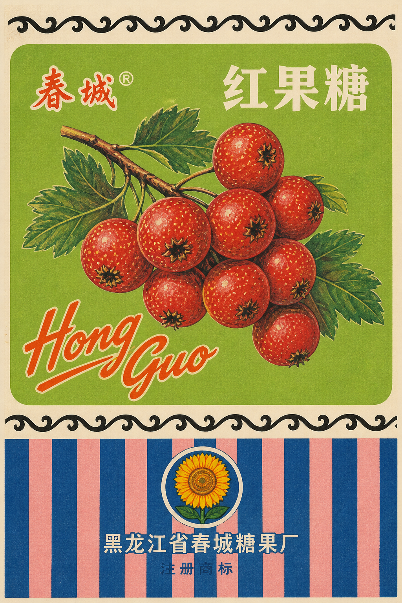
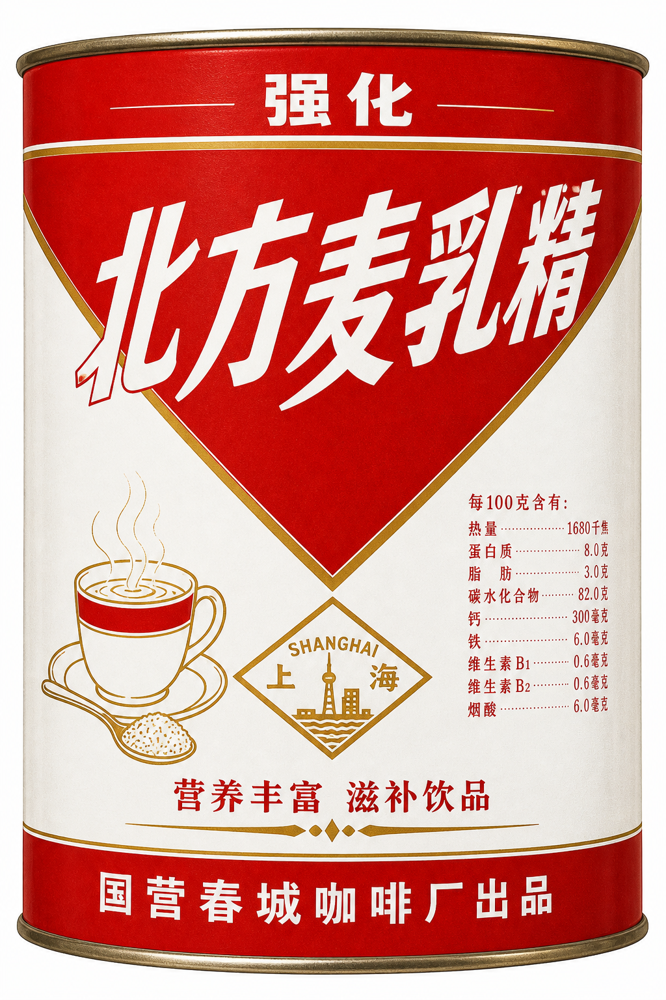
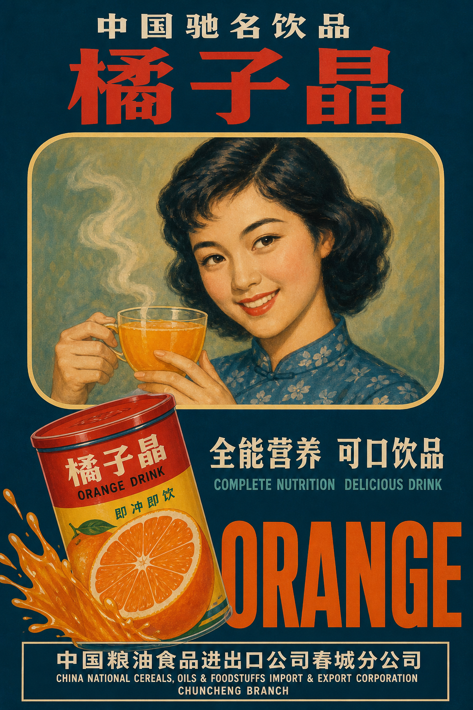
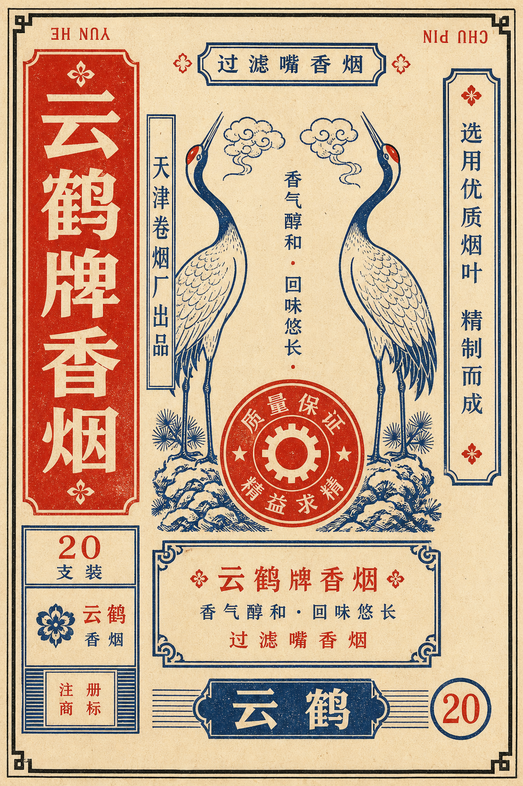
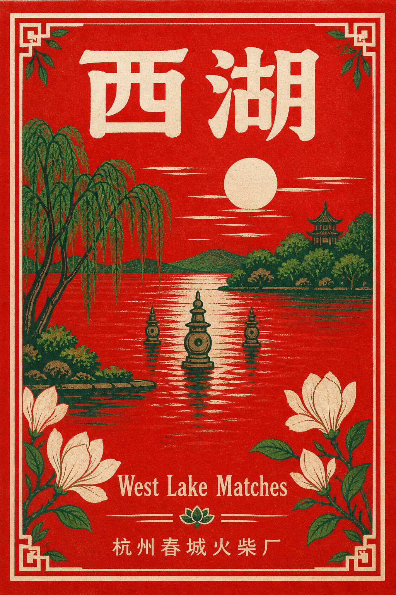
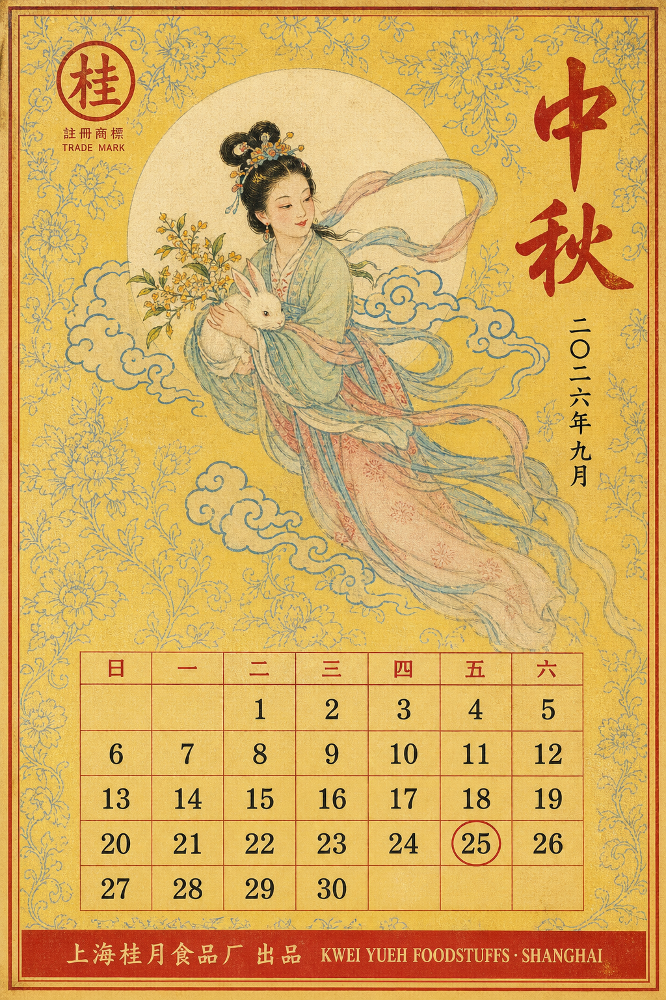
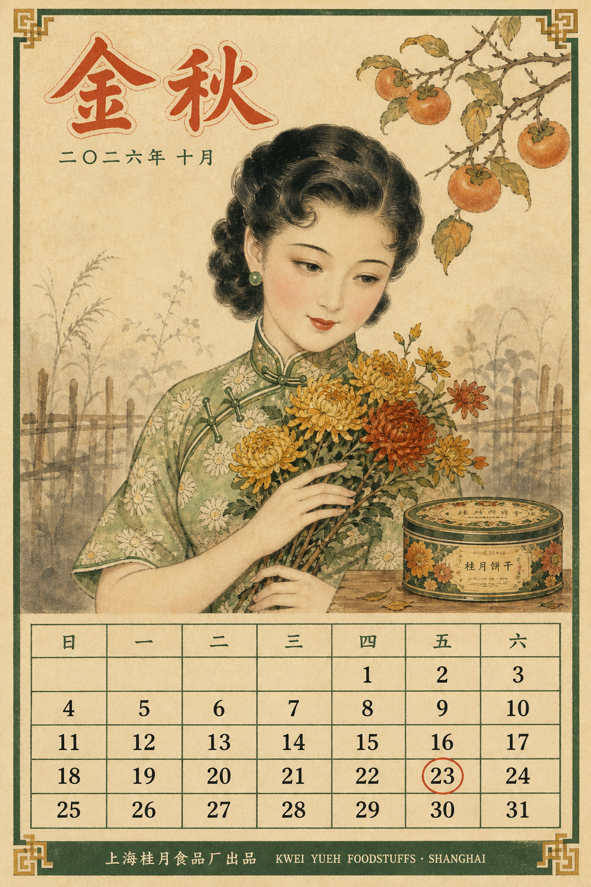
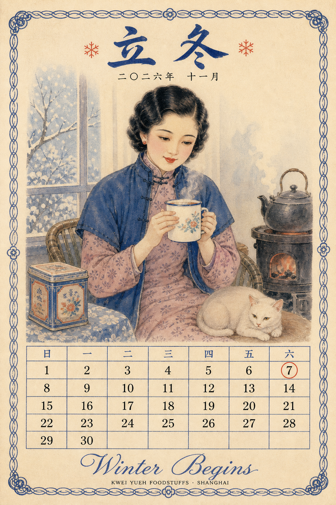
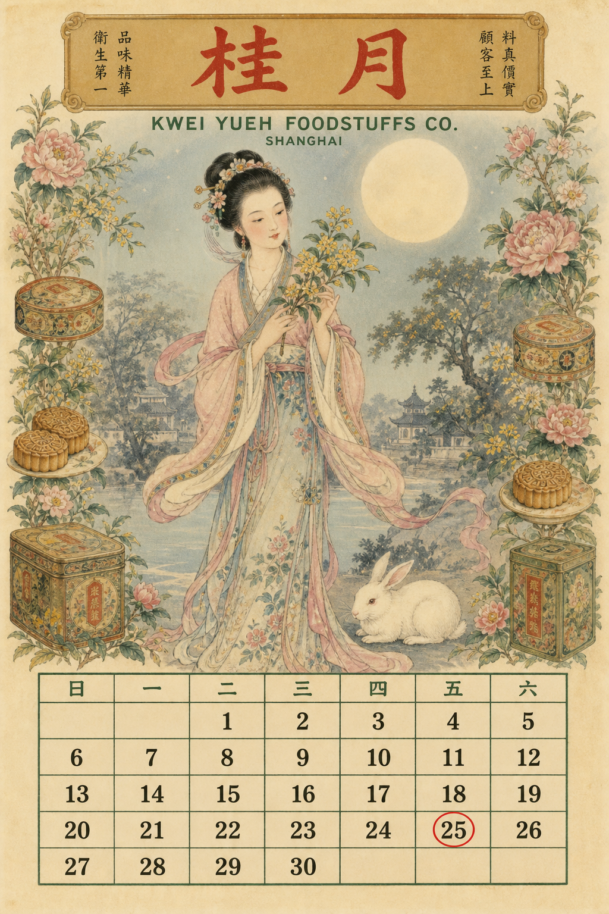
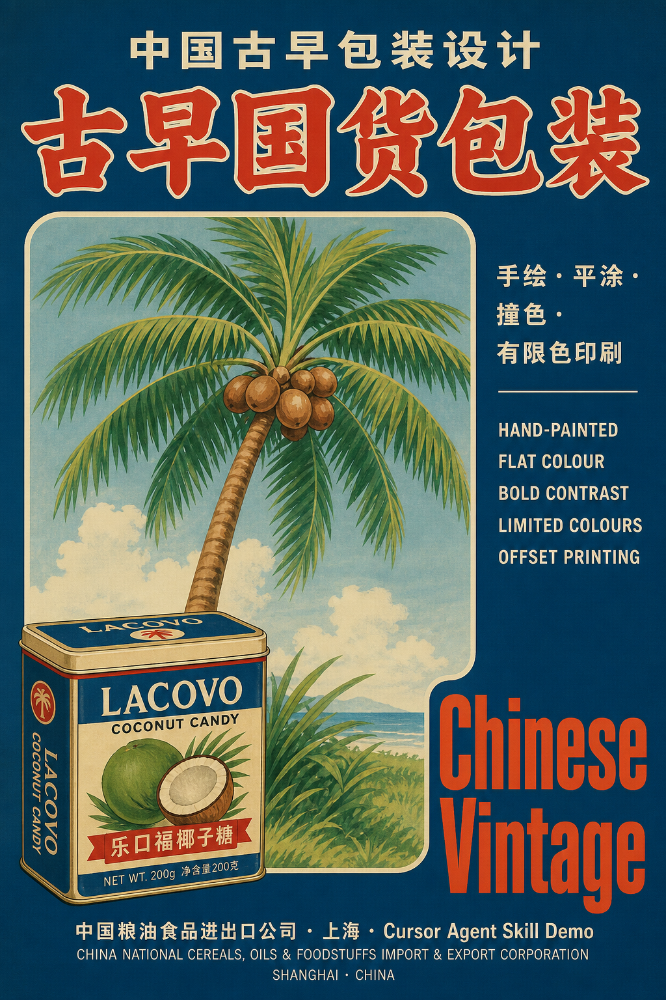

# Chinese Vintage Packaging

一个用于生成 **1965–2003 年中国古早国货商业包装平面设计** 的 Cursor Agent Skill。

它会把自然语言主题转译为糖纸、烟标、酒标、铁盒、标贴等复古平面印刷视觉：手绘、平涂、有限色撞色、美术字、有限色印刷。**默认竖版 3:4（小红书比例）**，参考澎湃新闻 [《百年上海设计》](https://www.thepaper.cn/newsDetail_forward_10027316) 展图 visual key，**不是**统一米黄做旧滤镜。

## 风格特征

- 手工手绘水果 / 动物 / 产品形，非摄影、非 3D
- 平涂色块 + 2–4 色有限胶印，轻微套色偏移
- 稳定配色族：蓝白红、红白、绿底 export、深青 + 红黄、蓝粉条纹
- 中文美术黑体 + 英文花体 / 拼音混排
- 虚构厂名地名，不复制真实注册商标
- **仅日常商业包装，拒绝任何政治敏感内容**

## Visual Key 参考

| Key | 来源 | 适用 |
|-----|------|------|
| 619 绿底面板 + 卷云纹 | 大白兔设计稿 | 水果糖纸 |
| 655 深青满底 + 破框 | 乐口福海报 | 出口饮料 / 海报 |
| 661 红 V 几何 | 上海麦乳精铁听 | 铁听 / 罐装 |
| 665 红白极简 | 美加净牙膏 | 日化盒 |
| 白鹤竖排 | 烟标参考 | 烟标 / 酒标 |

详见 [`SKILL.md`](./SKILL.md) 与 [`references/REFERENCE-CATALOG.md`](./references/REFERENCE-CATALOG.md)。

## 生成案例

### 小红书 batch-2 · 5 种 key 示范

<p align="center">
  
  
</p>
<p align="center">
  
  
</p>
<p align="center">
  
</p>

| 文件 | 品类 | Visual Key |
|------|------|------------|
| `examples/xhs-batch-2/01-*.png` | 水果糖纸 | 619 绿底 + 蓝粉条纹 |
| `examples/xhs-batch-2/02-*.png` | 铁听 | 661 红 V 几何 |
| `examples/xhs-batch-2/03-*.png` | 出口海报 | 655 深青满底 |
| `examples/xhs-batch-2/04-*.png` | 烟标 | 白鹤式竖排 |
| `examples/xhs-batch-2/05-*.png` | 火柴火花 | 满幅红底风景 |

小红书配文模板见 [`examples/xhs-batch-2/post-copy.md`](./examples/xhs-batch-2/post-copy.md)。

### 小红书 · 2026 秋日历套系（月份牌擦笔水彩）

画法统一为擦笔水彩人物，每月换一套 visual key。虚构厂牌「上海桂月食品厂」。

<p align="center">
  
  
</p>
<p align="center">
  
  
</p>

| 文件 | 月份 | Visual Key |
|------|------|------------|
| `examples/xhs-autumn-calendar/01-*.png` | 九月中秋 | 626 杏花楼月饼纸 |
| `examples/xhs-autumn-calendar/02-*.png` | 十月金秋 | 627 福生园饼干铁听 |
| `examples/xhs-autumn-calendar/03-*.png` | 十一月立冬 | 蓝白红糖纸族 |
| `examples/xhs-autumn-calendar/04-*.png` | 九月中秋 | 634 广生行双妹月份牌 |
| `examples/xhs-autumn-calendar/05-*.png` | 九月对比 | 655 深青静物（第一版） |

配文见 [`examples/xhs-autumn-calendar/post-copy.md`](./examples/xhs-autumn-calendar/post-copy.md)。

### 早期 demo

<p align="center">
  
</p>

更多 demo 见 [`examples/`](./examples/) 目录。

## 参考图库

Skill 内置 **26 张**参考图（抖音视频帧、EAGA 大白兔、澎湃新闻展图），详见 [`references/REFERENCE-CATALOG.md`](./references/REFERENCE-CATALOG.md)。

## 安装

```bash
git clone https://github.com/poemszhang/chinese-vintage-packaging-skill.git \
  ~/.cursor/skills/chinese-vintage-packaging
```

重新开启 Cursor 会话后即可通过自然语言触发。

也可下载 [Releases](https://github.com/poemszhang/chinese-vintage-packaging-skill) 中的 zip，解压到 `~/.cursor/skills/chinese-vintage-packaging/`。

## 使用示例

```text
做一张 70 年代东北水果糖纸，山楂主题，虚构厂牌，3:4 竖版。
```

```text
乐口福 key 的出口饮料海报，橘子汽水，深青满底。
```

```text
661 红 V 铁听结构，麦乳精风格，虚构品牌。
```

完整的风格定义、提示词模板、负面约束和验收标准请参阅 [`SKILL.md`](./SKILL.md)。

## 说明

- 蒸馏的是可复用的商业包装视觉语言，不复制特定品牌 exact 商标。
- 参考图仅供 Agent 生成前视觉锚定，**不是**机器学习训练数据。
- 调研档案见 [`RESEARCH.md`](./RESEARCH.md)。
