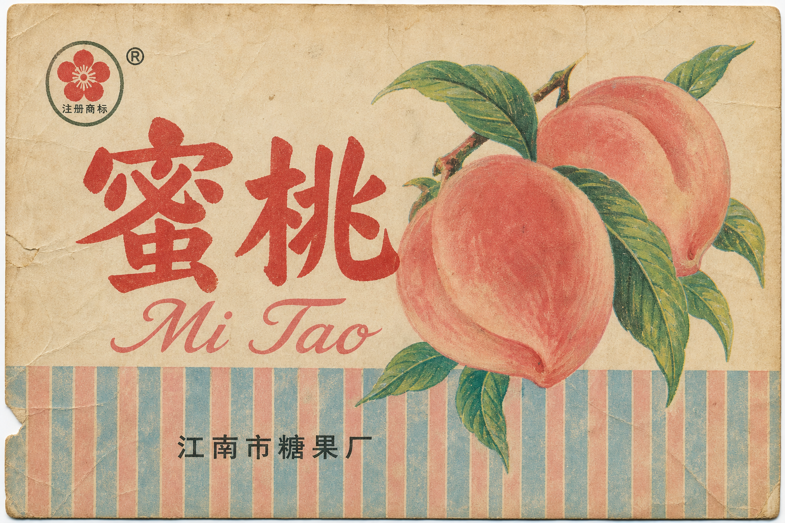

# Chinese Vintage Packaging

一个用于生成 **1965–2003 年中国古早国货商业包装平面设计** 的 Cursor Agent Skill。

它会把自然语言主题转译为糖纸、烟标、酒标、铁盒、标贴等复古平面印刷视觉：手绘、平涂、低饱和撞色、美术字、有限色印刷与纸纹套色偏移。

## 风格特征

- 手工手绘水果 / 动物 / 产品形，非摄影、非 3D
- 平涂色块 + 2–4 色有限胶印，轻微套色偏移
- 低饱和撞色：红白、蓝白、红绿、粉蓝竖条纹
- 中文美术黑体 + 英文花体 / 拼音混排
- 虚构厂名地名，不复制真实注册商标
- **仅日常商业包装，拒绝任何政治敏感内容**

## 生成案例

<p align="center">
  
</p>

## 参考图库

Skill 内置 26 张参考图（抖音视频帧、EAGA 大白兔、澎湃新闻「百年上海设计」展图），详见 [`references/REFERENCE-CATALOG.md`](./references/REFERENCE-CATALOG.md)。

## 安装

```bash
git clone https://github.com/poemszhang/chinese-vintage-packaging-skill.git \
  ~/.cursor/skills/chinese-vintage-packaging
```

重新开启 Cursor 会话后即可通过自然语言触发。

## 使用示例

```text
做一张 70 年代东北水果糖纸，蜜桃主题，虚构厂牌。
```

```text
天津风格老酒标，手绘鸭梨，中英混排，不要地图。
```

```text
80 年代铁盒护肤脂包装，手绘白玉兰，红白配色。
```

完整的风格定义、提示词模板、负面约束和验收标准请参阅 [`SKILL.md`](./SKILL.md)。

## 说明

- 蒸馏的是可复用的商业包装视觉语言，不复制特定品牌 exact 商标。
- 参考图仅供 Agent 生成前视觉锚定，**不是**机器学习训练数据。
- 调研档案见 [`RESEARCH.md`](./RESEARCH.md)。
